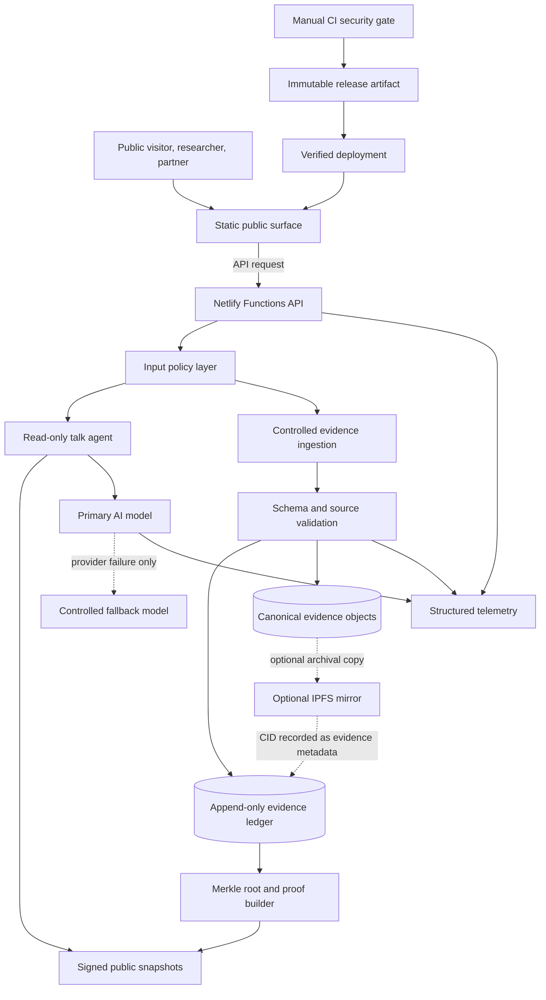
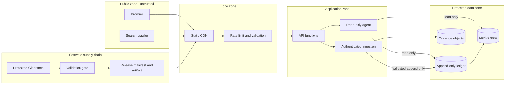

# 7YA Canonical Architecture

Status: active architecture boundary.

This document defines the production shape of 7ya.io. It is intentionally smaller than a generic multi-cloud platform. New infrastructure must solve a measured problem, preserve evidence integrity, and avoid creating a second production source.

## Product boundary

7ya.io is the canonical public identity, research, evidence, and participation surface for Igor Vepretski and 7YA.

The system is split into two production surfaces:

1. The canonical public frontend, delivered as a deterministic static artifact.
2. The API surface at `7ya-api.netlify.app`, delivered through Netlify Functions.

Netlify is API-only. It must not become a parallel publisher for the canonical frontend unless an explicit migration replaces the existing frontend provider.

## Data flow

## Trust zones

No request receives trust because of network location. Every write path requires explicit authentication, authorization, schema validation, and auditable provenance.

## Sources of truth

- Git is the source of truth for software and public static content.
- The append-only Evidence Ledger is the source of truth for evidence events.
- Canonical evidence objects remain in managed storage under retention policy.
- Merkle roots and proof paths prove evidence-set integrity.
- Release manifests prove software artifact integrity.
- Caches, vector indexes, AI outputs, and IPFS mirrors are derived systems. They are never authoritative sources.

## Release integrity

The Netlify API bundle contains:

- the exact function source deployed;
- a minimal static API surface;
- `deployment.json`, identifying the source commit;
- `release-manifest.json`, inventorying every release file with SHA-256 and one deterministic bundle hash.

The release gate must run in this order:

1. Install dependencies from `package-lock.json` with `npm ci`.
2. Audit production dependencies.
3. Typecheck.
4. Build and run Evidence Oracle tests, including Merkle proof validation and tamper rejection.
5. Run site and link checks.
6. Build the release bundle.
7. Verify its file inventory and bundle SHA-256 locally.
8. Deploy the exact GitHub revision.
9. Fetch the production release manifest and require byte-for-byte equality with the local manifest.
10. Verify `deployment.json` reports the exact GitHub SHA.
11. Run the production API smoke test.
12. Retain provider output, manifest evidence, revision evidence, and smoke evidence as a SHA-named artifact.

A deployment is not accepted when any step fails.

## Current infrastructure decisions

### Static-first frontend

The public site remains static-first for crawlability, speed, resilience, and provider portability. Next.js or another application framework requires a concrete product need and measured benefit.

### Netlify Functions for API

The current API remains on Netlify Functions. Azure Functions or AWS Lambda are migration options, not simultaneous production targets. A migration requires latency, cost, capacity, compliance, or reliability evidence.

### No Redis by default

Redis is introduced only after telemetry shows a repeatable cacheable bottleneck. Identity and evidence truth must never depend on cache state.

### PostgreSQL only for durable application state

When durable mutable state is required, PostgreSQL is preferred. Evidence records remain append-only and cryptographically linked.

### IPFS as mirror

IPFS content identifiers may be recorded for archival copies. IPFS is not the sole availability layer because content persistence still requires pinning and replication.

### Controlled model routing

Use one primary model and at most one policy-controlled fallback. Multi-model routing requires benchmark evidence showing a quality, latency, resilience, or cost improvement.

## Telemetry contract

Initial structured measurements are limited to decision-useful signals:

- request duration and status;
- AI provider, duration, and fallback use;
- evidence validation result and duration;
- ledger append duration;
- Merkle build duration;
- release manifest verification result;
- deployment SHA verification result;
- smoke-test result.

Telemetry must not contain secrets, authorization headers, raw private evidence, or unnecessary personal data.

## Change rule

A new database, queue, cache, vector service, cloud provider, model provider, or storage layer requires all of the following:

1. A measured current limitation.
2. A named owner and rollback path.
3. A data-classification and secret-handling review.
4. Deterministic tests and release evidence.
5. Confirmation that it does not create a second canonical production source.
